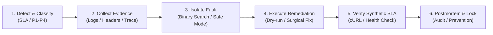
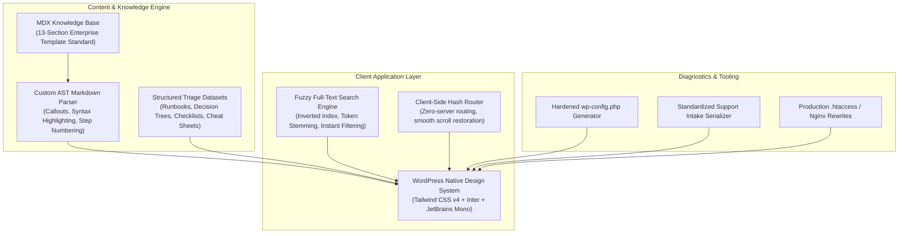

<p align="center">
  <a href="https://github.com/fzihak/WPST">
    
  </a>
</p>

<h1 align="center">WordPress Support Toolkit (WPST)</h1>

<p align="center">
  <strong>Enterprise-Grade Incident Response, Diagnostic Playbooks & Troubleshooting Knowledge Base for Mission-Critical WordPress Infrastructure</strong>
</p>

<p align="center">
  <a href="#-enterprise-architecture"></a>
  <a href="https://github.com/fzihak/WPST/blob/main/LICENSE"></a>
  <a href="#-technology-stack"></a>
  <a href="#-technology-stack"></a>
  <a href="#-technology-stack"></a>
  <a href="#-deployment-topologies"></a>
</p>

<p align="center">
  <a href="#-executive-summary">Executive Summary</a> •
  <a href="#-enterprise-incident-triage-methodology">Triage Methodology</a> •
  <a href="#-system-architecture">Architecture</a> •
  <a href="#-core-modules--capabilities">Core Modules</a> •
  <a href="#-incident-coverage-matrix">Coverage Matrix</a> •
  <a href="#-deployment-topologies">Deployment</a> •
  <a href="#-contribution-engineering-standard">Contribution Standard</a>
</p>

---

## 🏢 Executive Summary

WordPress powers over **43% of the top 10 million websites**, underpinning mission-critical e-commerce enterprises, high-volume media publications, government institutions, and SaaS marketing infrastructures. Yet, industry-standard WordPress troubleshooting remains plagued by:

- **Unstructured Guesswork**: *"Try deactivating all plugins and clear cache"* is not a triage strategy for an enterprise suffering $10,000/minute revenue loss.
- **Invasive Testing**: Running untested fixes in production without differential root-cause isolation risks silent database corruption, broken transactions, and PCI-DSS non-compliance.
- **Knowledge Siloing**: Tier 1, 2, and 3 escalation teams lack unified, timeboxed incident runbooks backed by reproducible log evidence.

**WordPress Support Toolkit (WPST)** bridges the gap between traditional ITIL/SRE incident management and WordPress internals. It delivers an investigation-first, evidence-backed operational framework that enables SREs, hosting platforms, agencies, and DevOps engineers to diagnose, contain, remediate, and postmortem complex outages in minutes.

---

## ⚖️ Engineering Standard: WPST vs. Amateur Triage

| Capability | Amateur / Ad-Hoc Triage | Enterprise WPST Standard |
| :--- | :--- | :--- |
| **Initial Approach** | Blind plugin deactivation; trial-and-error | **Evidence extraction** (HTTP headers, PHP-FPM slowlogs, MySQL locks) |
| **Outage Escalation** | Undocumented trial steps on production | **Timeboxed Incident Runbooks** with strict RTO/RPO parameters |
| **Complex Failures** | Reinstalling themes/plugins hoping for a fix | **Interactive Graph Decision Trees** narrowing faults layer-by-layer |
| **Database Integrity** | Blind search-replace queries risking serialize breaks | **Safe binary WP-CLI migrations** and transaction-safe dry runs |
| **Security Incidents** | Running random cleanup plugins on live code | **Forensic isolation**, core hash validation, and POSIX permissions lockdown |
| **Infrastructure Deployment** | Heavy external wiki dependencies / SaaS vendor locks | **Air-gapped single-file binary (<2.1MB)** deployable anywhere |

---

## 🔄 Enterprise Incident Triage Methodology

WPST enforces a strict, 6-stage operational lifecycle across all troubleshooting guides:



1. **Signal Detection & Severity Classification**: Map symptoms to strict SLA matrices (P1 Critical: Checkout/DB down → P4 Cosmetic: Font rendering).
2. **Deterministic Evidence Gathering**: Non-intrusive retrieval of diagnostic artifacts (`php_error.log`, `nginx/error.log`, `mysqladmin status`, `curl -sIv`).
3. **Binary Fault Isolation**: Isolate faults across the 7 application layers (DNS → Edge/CDN → Reverse Proxy → PHP-FPM → Object Cache → MySQL → WP Hooks).
4. **Surgical Remediation**: Implement minimally invasive fixes with automatic rollback paths and zero customer data loss.
5. **Synthetic Verification**: Validate synthetic user journeys (cURL headless HTTP status, database transaction integrity, OPcache invalidation).
6. **Hardening & Postmortem**: Implement preventative monitoring rules, automated log alarms, and write-lock protections.

---

## 🏛️ System Architecture

WPST is engineered as an **offline-first, zero-runtime dependency Single Page Application (SPA)** that compiles down to a **single, standalone HTML file**. It guarantees emergency accessibility even during total infrastructure collapse or air-gapped recovery environments.



---

## ⚡ Core Modules & Capabilities

### 1. ⏱️ Timeboxed Tactical Runbooks
Engineered for P1/P2 emergency escalations. Each runbook provides a chronological timebox, commands with automated copy actions, and explicit *"Look For"* outputs:
- **`site-down`**: Critical 5-minute restoration sequence for complete service outages.
- **`payment-failure`**: Payment gateway timeout, session token loss, and webhook delivery debugging.
- **`white-screen`**: Silent fatal error trapping, memory exhaustion recovery, and WP recovery mode extraction.
- **`plugin-conflict`**: Binary search algorithm to identify misbehaving plugins in $\mathcal{O}(\log n)$ deployments.

### 2. 🌲 Graph-Driven Decision Trees
Interactive step-by-step state machines that guide Tier 1 & 2 engineers through structured diagnosis without jumping to conclusions:
- **Website Down Triage**: Narrow from DNS failure $\rightarrow$ Nginx gateway timeout $\rightarrow$ PHP-FPM pool death $\rightarrow$ MySQL lock.
- **Broken Layout & CSS**: Differentiate CDN cache invalidation from Elementor generated CSS corruption and SSL mixed content.
- **Transactional Email Drops**: Diagnose SMTP socket handshakes, server mail queues, and DNS SPF/DKIM/DMARC records.

### 3. 📋 Persistent Operational Checklists
Audit readiness and migration verification tools stored securely in browser `localStorage` (zero data transmission):
- **Production Pre-Launch Verification**: 35-point audit covering caching, cron offloading, security salts, and backup automation.
- **Enterprise Site Migration**: Multi-stage checklist ensuring zero DNS propagation downtime and database serialization safety.
- **Hardened Security & PCI-DSS Compliance**: File permissions matrix, brute-force mitigation, and REST API exposure control.

### 4. 💻 Specialized Command Cheat Sheets
Production-tested command-line snippets for high-pressure operations:
- **WP-CLI**: Maintenance mode toggles, transient flushes, core integrity validation, search-replace dry runs.
- **MySQL / MariaDB**: Processlist interrogation, InnoDB table repair, lock identification, user privilege grants.
- **Linux & Permissions**: Hardened POSIX ACLs (`755/644`), sticky bit enforcement, web server user reconciliation.
- **NGINX & Apache**: Microcaching rules, upstream FastCGI buffers, gzip/brotli compression, SSL reverse proxies.

---

## 📊 Incident Coverage Matrix

WPST covers the full spectrum of WordPress enterprise failure points across all infrastructure tiers:

```
WPST Incident Coverage
├── 🌐 Network & Edge (Cloudflare, DNS, SSL Handshake, Redirect Loops)
├── ⚡ Web Server (Nginx FastCGI Buffers, Apache .htaccess, HTTP 502/503/504)
├── ⚙️ PHP Runtime (Memory Exhaustion, OOM Killer, OPcache Corruption, Timeouts)
├── 🗄️ Database Tier (Max Connections, Deadlocks, Search-Replace Deserialization)
├── 📦 WordPress Core (Maintenance Locks, Cron Failures, Permalinks 404, Recovery Mode)
├── 🔌 Plugins & Themes (Hook Fatals, Query Monitor Slow Queries, Autoload Bloat)
├── 💳 E-Commerce (WooCommerce Cart Session Loss, Webhook Invalidation, Taxes)
└── 🛡️ Security & Forensics (Core Checksum Tampering, Backdoors, Brute Force)
```

---

## 🎨 Enterprise Design System

WPST strictly implements the **official WordPress Admin & Developer Design Tokens**, establishing immediate cognitive familiarity for technical operators:

- **Typography**: `-apple-system`, `BlinkMacSystemFont`, `"Segoe UI"`, `Inter` paired with `"JetBrains Mono"` for high-legibility terminal code.
- **Color Palette**:
  - WordPress Blue Primary: `#2271b1` (Hover: `#135e96`)
  - WordPress Dark Admin Bar & Terminal: `#1d2327` (Mid: `#2c3338`, Soft: `#191e23`)
  - Status Indicators: Error `#d63638`, Warning `#dba617`, Success `#00a32a`, Notice `#72aee6`
- **Code Blocks**: Embedded macOS traffic indicator dots, syntax tokenization (Bash, WP-CLI, PHP, SQL, Nginx, Apache), non-selectable line numbers (`user-select: none`), and animated clipboard feedback.

---

## 🚀 Deployment Topologies

WPST can be deployed across several enterprise architectures:

### Option A: Standalone Air-Gapped Single-File (Recommended for SREs)
Because WPST uses `vite-plugin-singlefile`, running `npm run build` compiles **all JavaScript, CSS, SVGs, and images into a single self-contained HTML file**:
```bash
npm run build
# Result: dist/index.html (~2MB)
```
- Store on secure emergency flash drives for offline server room disaster recovery.
- Host directly from an internal S3 bucket, Cloudflare R2, or network-attached storage (NAS).

### Option B: Cloudflare Pages / Vercel / GitHub Pages
Deploy with zero server configuration:
```bash
git clone https://github.com/fzihak/WPST.git
cd WPST
npm install
npm run build
# Point your deployment target to dist/
```

### Option C: Enterprise Docker Container
Run an ultra-lightweight, alpine-based Nginx container:
```dockerfile
FROM nginx:alpine
COPY dist/index.html /usr/share/nginx/html/index.html
EXPOSE 80
CMD ["nginx", "-g", "daemon off;"]
```

---

## 🛠️ Local Development

### Prerequisites
- Node.js `18.0.0` or higher
- npm `9.0.0` or higher

```bash
# 1. Clone repository
git clone https://github.com/fzihak/WPST.git

# 2. Navigate to project root
cd WPST

# 3. Install dependencies
npm install

# 4. Start high-performance Vite HMR development server
npm run dev
```

Local server will be live at `http://localhost:5173/`.

### Quality & Static Analysis
```bash
# Run strict TypeScript compilation checks
npx tsc --noEmit

# Build production bundle and verify single-file inlining
npm run build
```

---

## 📑 Contribution Engineering Standard

To maintain rigorous enterprise quality, every article submitted to `content/<section>/<slug>.mdx` must strictly follow the **13-Section Diagnostic RFC Specification**:

```markdown
---
title: "Descriptive Problem Statement"
description: "Root cause diagnosis and impact statement"
difficulty: "beginner | intermediate | advanced"
timeToFix: "5 min | 15 min | 30 min"
severity: "P1 | P2 | P3 | P4"
appliesTo: "WordPress 6.x+, PHP 8.x+, Nginx/Apache"
tags: ["mysql", "timeout", "woocommerce"]
updated: "2026-09-17"
---

## Symptoms
## What Caused It
## Initial Assessment (First 60 Seconds)
## Investigation & Evidence Collection
## Isolation Procedure
## Step-by-Step Resolution
## Verification & Proof
## Prevention & Hardening
## Rollback Plan
## Real-World Edge Cases
## Related Incidents
## Official Documentation References
```

---

## 🛡️ Security & Responsible Disclosure

Security is fundamental to mission-critical infrastructure.
- **Redaction Policy**: All documentation examples redact internal domain names, API secrets, IP addresses, database credentials, and customer PII.
- **Reporting Vulnerabilities**: If you identify a security gap or vulnerability within WPST tools, please file an issue or submit a secure patch via GitHub Security Advisories.

---

## 📜 License

Licensed under the permissive [MIT License](LICENSE).  
Copyright (c) 2026 **WordPress Support Toolkit (WPST) Contributors**.
